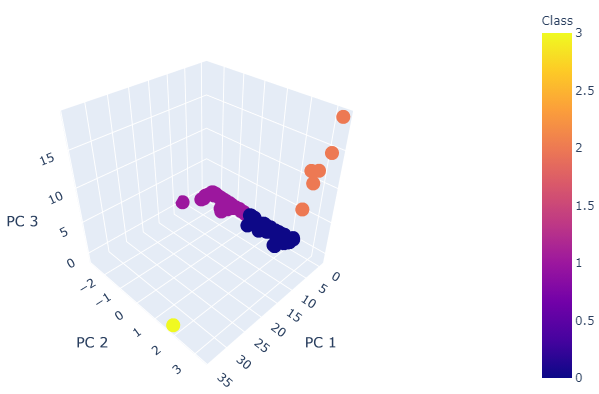
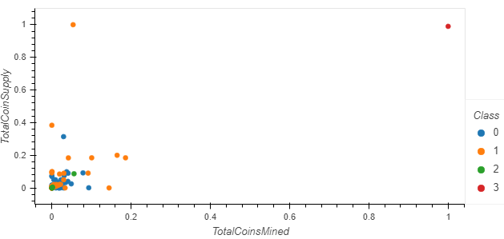

# Cryptocurrencies
## Use unsupervised learning to analyze data on the cryptocurrencies traded on the market.

#### Summary
Data preprocessing tasks have been performed to prepare the cryptocurrency data for dimensions reduction with PCA and clustering using K-means. The data dimensions were then reduced using PCA algorithms from sklearn. Next, clusters were predicted using cryptocurrencies and the K-means algorithm from sklearn. Finally, the below plots and data table were created to present the results. 

#### 3D scatter plot using Plotly Express to plot the clusters

Based on the 3D scatter plot above, class 1 is classified based on negative values for PC 2  (principal component 2) while class 0 is classified based on positive values for PC 2; both class 1 and class 0 also have relatively low PC 1 and PC 3 values. Cryptocurrency BitTorrent has been classified as its own class, class 3, since it has a positive PC 2 value and a low PC 3 value, but a high PC 1 value. Since this data point is not clustered with any others, it can possibly be considered an outlier of the dataset. The final cluster, class 2, has positive PC 2 values and low PC 1 values, however, it has relativly high PC 3 values.

#### Scatter plot using hvplot.scatter to present the clustered data

TotalCoinSupply and TotalCoinsMined have been scaled using sklearn.preprocessing.MinMaxScaler; this estimator scales and translates each individually such that it is in the given range between zero and one. The plot shows that class 0 is clustered around relatively low TotalCoinsMined and TotalCoinSupply, and the majority of the data points are clustered around similar values of less than 0.12 TotalCoinsMined and TotalCoinSupply. Also, the amount mined was either similar to or greater than the amount supplied. On the other hand, Class 1 is also clustered around similar values as class 0. However, class 1 has more instances where the amount of coins supplied is greater than the amount mined. 
